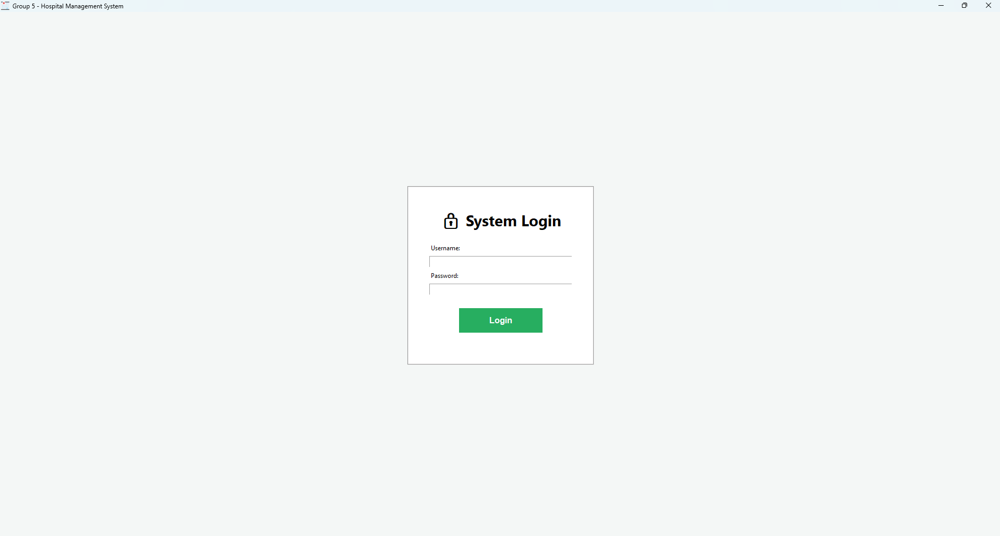
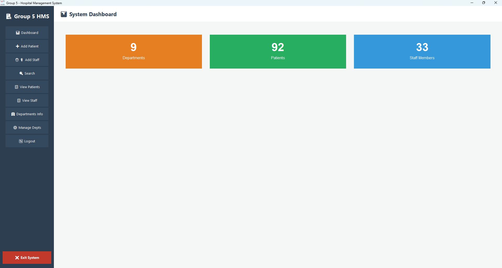
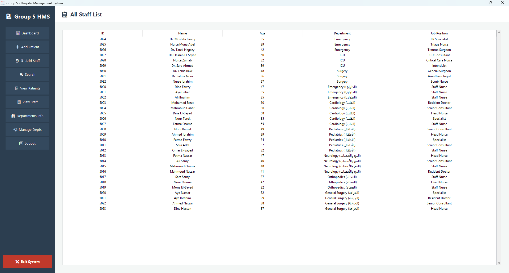
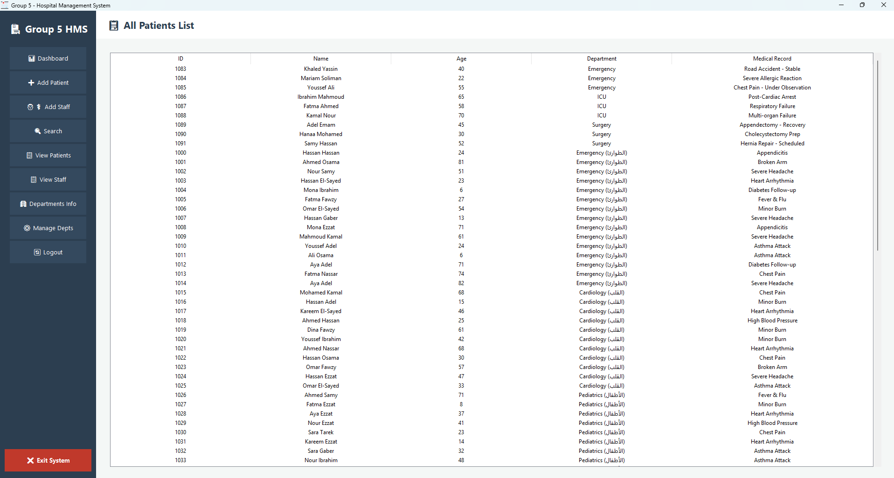
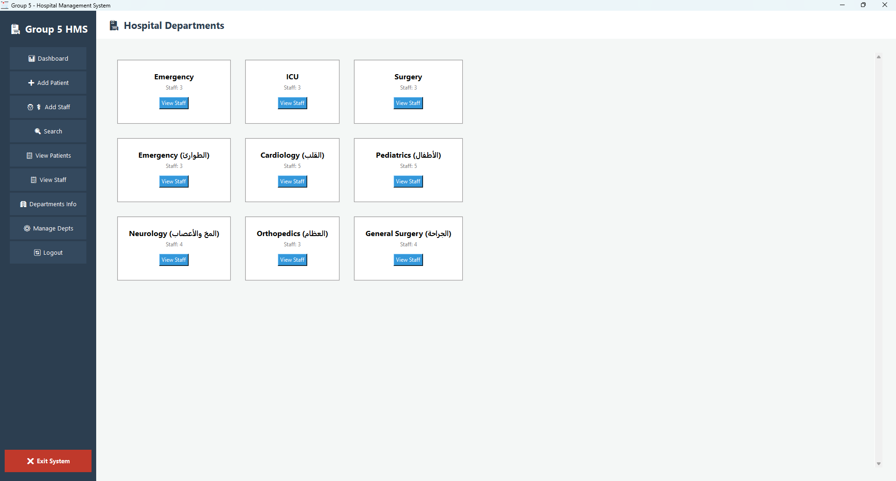
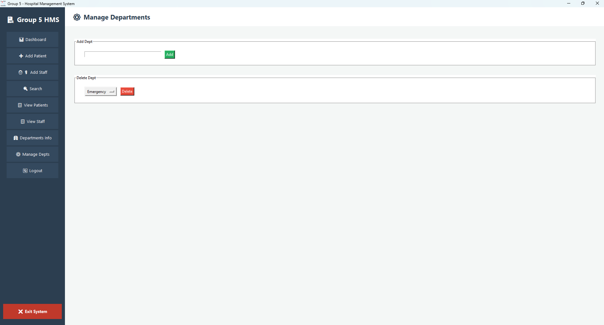

# 🏥 Group 2 - Hospital Management System (HMS)

> **Developed by Ahmed Elkhafef**

> *Supervised by [Eng/George Samuel]*

---

## 📌 Project Overview

The **Hospital Management System (HMS)** is a comprehensive desktop-based GUI application built using **Python** and **Tkinter**. It streamlines administrative operations of a hospital, enabling users to efficiently manage departments, medical staff, and patient records. The system features a user-friendly interface and secure **Role-Based Access Control (RBAC)**.

---

## 📸 Application Screenshots

### 1. Login Screen



### 2. Interactive Dashboard

*Real-time statistics with clickable navigation shortcuts.*


### 3. Medical Staff Directory

*Comprehensive list of doctors and nurses across all departments.*


### 4. Patient Records Management

*Detailed patient database with smart search and sorting.*


### 5. Departments Overview

*Card-based layout showing hospital divisions and staff counts.*


### 6. Admin Department Management

*Exclusive interface for administrators to add or remove hospital wings.*


---

## 🏗️ Project Structure (File Organization)

The project follows a clean, modular, Object-Oriented structure separating data models, business logic, and the user interface.

```
Group 2 - HMS/
│
├── __init__.py             # Marks root directory as Python package
├── app.py                  # 🖥️ Main GUI Application Entry Point (Tkinter)
├── main.py                 # 📟 CLI Fallback Version
├── icon.ico                # 🖼️ Application Icon
├── README.md               # 📄 Project Documentation
│
├── core/                   # ⚙️ Business Logic Layer
│   ├── __init__.py
│   └── SystemManager.py    # Controller managing data flow
│
├── model/                  # 📦 Data Models Layer
│   ├── __init__.py
│   ├── Person.py           # Base class
│   ├── Patient.py          # Inherits from Person, medical records
│   ├── Staff.py            # Inherits from Person, position info
│   ├── Department.py       # Hospital division with staff/patients
│   └── Hospital.py         # Core entity containing all departments
│
├── database/               # 💾 Data Persistence
│   ├── hospital_data.json  # Local JSON database
│   └── activity_log.txt    # Logs user actions
│
└── dist/                   # 🚀 Deployment Folder
    └── app.exe             # Standalone executable
```

---

## ✨ Key Features & Enhancements

* **🖱️ Interactive Navigation:** Dashboard boxes as clickable shortcuts.
* **🏢 Scrollable Cards View:** Grid-based department view with scrollbar.
* **🔐 Secure Login:** Dual-level access (Admin/User).
* **📋 Advanced Sorting:** Tables sortable by column headers.
* **🔍 Dynamic Search:** Global search for any person.
* **🤕 Patient Management:** Register or discharge patients.
* **👨‍⚕️ Staff Management:** Recruit or remove staff.
* **🏢 Department Management:** Add/remove hospital departments dynamically.
* **💾 Data Persistence:** Safe file path management ensures no data loss.

---

## 🏗️ Architecture & UML Design

The system uses a hierarchical, modular design:

1. **Person (Base Class):** Common attributes like `name` and `age`.
2. **Patient & Staff (Subclasses):**

   * `Patient` → includes `medical_record`.
   * `Staff` → includes `position` or role.
3. **Department:** Composes lists of `Patients` and `Staff`.
4. **Hospital:** Aggregates multiple `Department` objects.
5. **SystemManager:** Controller managing the `Hospital` instance and operations.

---

## 🚀 How to Run the Application

### Option 1: Running the Executable (Recommended)

1. Go to the `dist/` folder.
2. Ensure `database/`, `icon.ico`, and `docs/` are in the same directory.
3. Launch `app.exe`.

### Option 2: Running from Source Code

1. **Install Python:** Version 3.10+ (check "Add Python to PATH").
2. **Download Project Files:** Extract to preferred directory.
3. **Open Terminal/Command Prompt:**

   ```bash
   cd path/to/Group-5-HMS
   ```
4. **Install Dependencies:** Tkinter is standard in Python.
5. **Run the Application:**

   ```bash
   python app.py
   ```

> ⚠️ **Important:** Do **not** run internal modules directly (`Patient.py`, `Staff.py`, etc.). Use `main.py` or `app.py`.

---

## 🔑 Default Login Credentials

| Role  | Username | Password |
| ----- | -------- | -------- |
| Admin | admin    | admin123 |
| User  | user     | 123456   |

---

## 🛠️ Implementation Details

* **Language:** Python
* **Paradigm:** Object-Oriented Programming (OOP)
* **Key Concepts:**

  * `super()` for inheritance
  * List comprehensions for efficient data handling
  * Encapsulation within `SystemManager` and `Hospital`

---

## ⚡ Class Relationships

* `Person` → Base class
* `Patient` & `Staff` → Inherit from `Person`
* `Department` → Composes `Patients` & `Staff`
* `Hospital` → Aggregates `Departments`
* `SystemManager` → Manages `Hospital` instance
